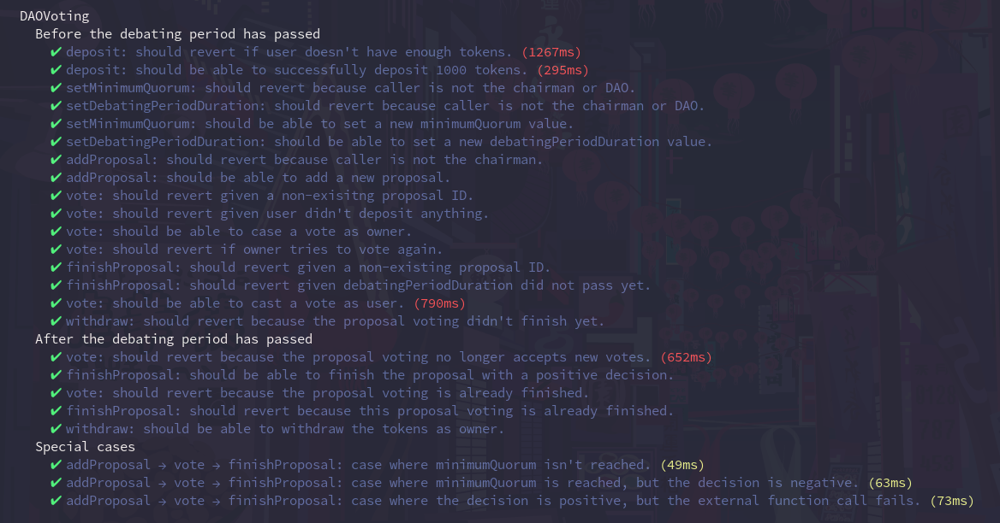

# DAO Voting ✅

A DAO proposal voting implementation with ERC-20 tokens.

## Features

- [x] The contract is deployed to Rinkeby test network and verified on [Etherscan](https://rinkeby.etherscan.io/address/0xadb73b0e9bCf92d6Fe62011bE0028D58Ae7adDA2#code) @0xadb73b0e9bCf92d6Fe62011bE0028D58Ae7adDA2.
- [x] Tests provide a 100% coverage (see **"Notes regarding test"** though).
- [x] Tasks cover most of the interfaces exposed in the ABI (see _tasks/_).
- [x] All interfaces exposed in the ABI are covered by NatSpec in the smart contract.
- [x] A comprehensive Markdown documentation is available in _docs/_.

## Usage

**IMPORTANT: all variable data needed to deploy/use/test the contract is stored in config.ts**

1. Signer who's authorized as the chairman may add new proposals.
Below is a sample proposal which serves no practical meaning other than to showcase the functionality.

```
hh signerAddresses --network rinkeby
0x9271EfD9709270334721f58f722DDc5C8Ee0E3DF
0x53b5Dd95992F7C197bCe8a9Dc92546CD83B39a98

hh addProposal --signer 0 --calldata "0x00" --recipient "0x53b5Dd95992F7C197bCe8a9Dc92546CD83B39a98" --description "Just a test, lol." --network rinkeby
Created a new proposal with ID 10.
-------------------------
Description: Just a test, lol.
Start UNIX timestamp: 1654972830.
Recipient address in case of success: 0x53b5Dd95992F7C197bCe8a9Dc92546CD83B39a98.
Bytes used for call in case of success: 0x00.
```

2. Let's try to deposit some tokens and vote.

Firstly, let's get an overview of the default parameters set in the constructor.

```
hh minimumQuorum --network rinkeby
minimumQuorum value is 4 votes.

hh debatingPeriodDuration --network rinkeby
debatingPeriodDuration value is 259200 seconds.
```

Secondly, let's make deposits and cast votes with 2 different signers.

```
hh deposit --signer 0 --amount 200 --network rinkeby
0x9271EfD9709270334721f58f722DDc5C8Ee0E3DF deposited 200 tokens.

hh deposit --signer 1 --amount 100 --network rinkeby
0x53b5Dd95992F7C197bCe8a9Dc92546CD83B39a98 deposited 100 tokens.

hh vote --signer 0 --proposal-id 10 --decision false --network rinkeby
Casted a vote for a proposal with ID 10.
-------------------------
Voter: 0x9271EfD9709270334721f58f722DDc5C8Ee0E3DF.
Voted `for`: false.
Votes: 200.

hh vote --signer 1 --proposal-id 10 --decision true --network rinkeby
Casted a vote for a proposal with ID 10.
-------------------------
Voter: 0x53b5Dd95992F7C197bCe8a9Dc92546CD83B39a98.
Voted `for`: true.
Votes: 100.
```

3. Now let's finish up our test proposal vote.

Firstly, let's change the debatingPeriodDuration.

```
hh setDebatingPeriodDuration --signer 0 --value 60 --network rinkeby
debatingPeriodDuration value has been changed from 259200 to 60.
```

Secondly, let's call the finishProposal function.

```
hh finishProposal --signer 1 --proposal-id 10 --network rinkeby
Finished a proposal with ID 10.
-------------------------
Description: Just a test, lol.
Accepted: false.
Total votes: 300.
Positive votes: 100.
Minimum quorum is met: true.
```

We are well above the minimum quorum (300 > 4).
Only 100 out of 300 votes are _for_, thus the proposal is declined.

4. After the proposal voting has concluded, participants may withdraw their tokens :)

```
hh withdraw --signer 0 --network rinkeby
0x9271EfD9709270334721f58f722DDc5C8Ee0E3DF has withdrawn 200 tokens.

hh withdraw --signer 1 --network rinkeby
0x53b5Dd95992F7C197bCe8a9Dc92546CD83B39a98 has withdrawn 100 tokens.
```

P.S. _hh_ is an alias for _npx hardhat_.

## Demonstration




## Notes regarding tests

For some weird reason _solidity-coverage_ refuses to see the coverage for one particular branch, although it's clearly covered.
Yet to find our why.


